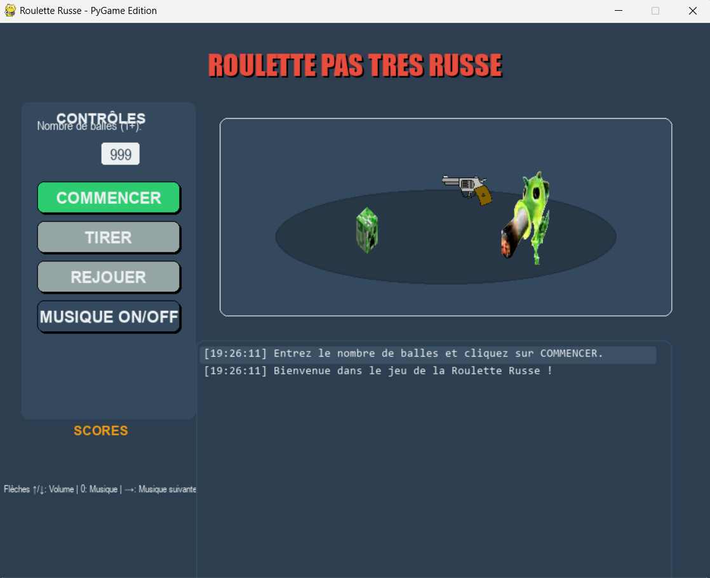

# Roulette Russe Adventure

<div align="center">
  
</div>

<p align="center">
  <em>Une version élégante et animée du classique jeu de roulette russe, développée avec PyGame</em>
</p>

<p align="center">
  <a href="#fonctionnalites">Fonctionnalités</a> •
  <a href="#gameplay">Gameplay</a> •
  <a href="#installation">Installation</a> •
  <a href="#architecture">Architecture</a> •
  <a href="#informations-sur-le-developpement">Informations sur le développement</a>
</p>

## Fonctionnalités

- **Expérience de jeu immersive** : Animations élégantes, effets sonores et retours visuels
- **Mode deux joueurs** : Affrontez un ami avec des pseudos personnalisés
- **Système de défi de mots** : Tapez rapidement des mots pour survivre face à une chambre chargée
- **Score persistant** : Suivi et enregistrement des performances des joueurs sur plusieurs parties
- **Journal d'événements dynamique** : Mises à jour du jeu en temps réel affichées dans une console défilante
- **Contrôles de la musique personnalisables** : Réglez le volume ou activez/désactivez la musique de fond

## Gameplay

Roulette Russe Adventure propose une version moderne du concept classique de la roulette russe :

1. **Préparation** : Les joueurs saisissent leurs pseudos et choisissent le nombre de balles dans le barillet
2. **Tour par tour** : Les joueurs tirent à tour de rôle sur la gâchette d’un revolver virtuel
3. **Défi de mots** : Face à une chambre chargée, les joueurs doivent taper rapidement un mot affiché pour survivre
4. **Système de score** : Les joueurs gagnent des points en survivant, tandis que leurs adversaires sont éliminés
5. **Classement global** : Les performances sont suivies sur plusieurs sessions grâce à un classement persistant

<div align="center">
  
</div>

## Installation

```bash
# Cloner le dépôt
git clone https://github.com/yourusername/roulette-russe-adventure.git

# Aller dans le répertoire du projet
cd roulette-russe-adventure

# Installer les dépendances requises
pip install pygame

# Lancer le jeu
python main.py
```

## Architecture

Le jeu repose sur une architecture modulaire comprenant les composants principaux suivants :

- **Classe Game** : Contrôleur central gérant l'état et la logique du jeu
- **Classe Player** : Gère la représentation et les animations des joueurs
- **Composants UI** : Classes Button, TextBox et EventLog pour l’interface utilisateur
- **Système d’animation** : Gère les effets visuels comme le recul, les secousses d’écran et les transitions
- **Stockage persistant** : Système basé sur JSON pour sauvegarder les scores et l’historique du jeu

### Diagramme de classes

```
┐─────────────┘      ┐─────────────┘      ┐─────────────┘
|    Game     |◄────|   Player   |      |   Button     |
|─────────────|      |─────────────|      |─────────────|
| - barillet  |      | - x, y     |      | - rect       |
| - joueur    |      | - angle    |      | - color      |
| - scores    |      | - image    |      | - text       |
|─────────────|      |─────────────|      |─────────────|
| + shoot()   |      | + draw()   |      | + draw()     |
| + restart() |      | + reset()  |      | + is_hovered |
└─────────────┘      └─────────────┘      └─────────────┘
```

## Informations sur le développement

### Défis techniques

- **Animations fluides** : Création de transitions naturelles entre les états du jeu
- **Système de défi de mots** : Équilibrer la difficulté et le timing pour une survie basée sur les compétences

## Licence

Ce projet est sous licence MIT - voir le fichier LICENSE pour plus de détails.
